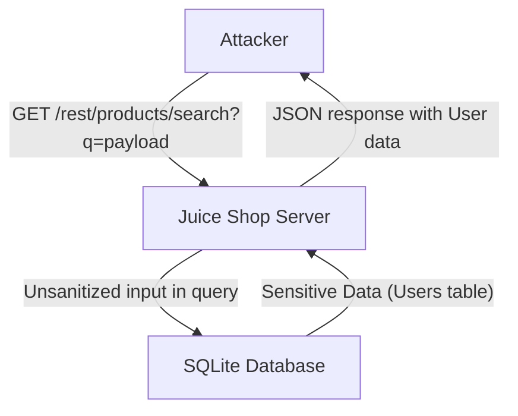

# SQL Injection in Product Search

### Executive Summary
The OWASP Juice Shop application is vulnerable to a Critical SQL Injection in the product search functionality. By providing a specially crafted query parameter `q`, an attacker can escape the intended SQL query and execute arbitrary SQL commands. This allows for the extraction of sensitive information from the database, including user emails and hashed passwords.

### Root Cause Analysis
The vulnerability exists in `routes/search.ts` within the `searchProducts` function. The `criteria` variable, which is derived from the `q` query parameter, is directly embedded into a SQL query using template literals without any sanitization or parameterization.

File: `routes/search.ts`
```typescript
export function searchProducts () {
  return (req: Request, res: Response, next: NextFunction) => {
    let criteria: any = req.query.q === 'undefined' ? '' : req.query.q ?? ''
    criteria = (criteria.length <= 200) ? criteria : criteria.substring(0, 200)
    models.sequelize.query(`SELECT * FROM Products WHERE ((name LIKE '%${criteria}%' OR description LIKE '%${criteria}%') AND deletedAt IS NULL) ORDER BY name`) // vuln-code-snippet vuln-line unionSqlInjectionChallenge dbSchemaChallenge
      .then(([products]: any) => {
        // ...
```

The line:
`models.sequelize.query(\`SELECT * FROM Products WHERE ((name LIKE '%${criteria}%' OR description LIKE '%${criteria}%') AND deletedAt IS NULL) ORDER BY name\`)`
directly incorporates the user-controlled `criteria` into the SQL statement.

### Threat Model Analysis
- **Trust Boundary**: The application accepts input from the user via the `q` query parameter in a GET request.
- **Vulnerability**: The input is used to construct a SQL query without proper escaping or parameterization.
- **Impact**: An attacker can bypass the intended query logic to access or modify data in the database. In this case, a UNION-based SQL injection allows extracting any data from the database that the database user has access to.

### Reproducing the Vulnerability

#### Prerequisites
- The Juice Shop application must be running.

#### Steps
1. Send a GET request to `/rest/products/search?q=` with a payload designed to break out of the `LIKE` clause and perform a `UNION SELECT`.
2. The payload `apple')) UNION SELECT id,email,password,4,5,6,7,8,9 FROM Users--` effectively transforms the query into:
   ```sql
   SELECT * FROM Products WHERE ((name LIKE '%apple')) UNION SELECT id,email,password,4,5,6,7,8,9 FROM Users--%' OR description LIKE '%apple')) UNION SELECT id,email,password,4,5,6,7,8,9 FROM Users--%') AND deletedAt IS NULL) ORDER BY name
   ```
   Actually, it's more like:
   ```sql
   SELECT * FROM Products WHERE ((name LIKE '%apple')) UNION SELECT id,email,password,4,5,6,7,8,9 FROM Users--%' OR description LIKE '%...
   ```
   The `--` comments out the rest of the original query.

3. The application returns the results of the second query (the `UNION SELECT` from the `Users` table) in the JSON response.

#### Mermaid Diagram


### Fix Recommendation
The vulnerability should be fixed by using parameterized queries instead of string concatenation or template literals. This ensures that the database driver handles the escaping of special characters correctly.

Example fix using Sequelize's replacements:
```typescript
models.sequelize.query(
  'SELECT * FROM Products WHERE ((name LIKE :criteria OR description LIKE :criteria) AND deletedAt IS NULL) ORDER BY name',
  {
    replacements: { criteria: `%${criteria}%` },
    type: models.sequelize.QueryTypes.SELECT
  }
)
```

